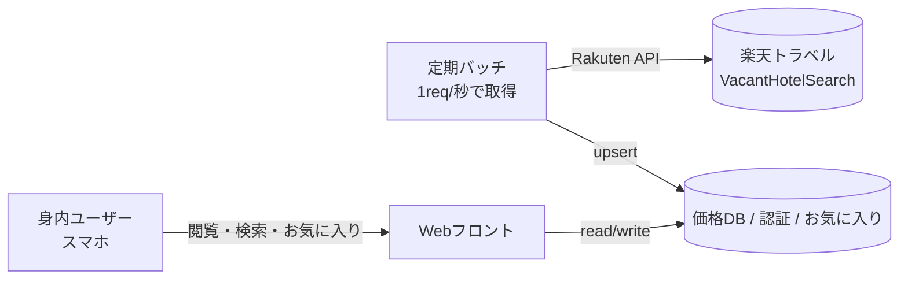

# フサキビーチリゾート石垣島 価格監視ツール 仕様書

> Claude Code 実装指示用ドキュメント
> 楽天トラベル空室検索API（VacantHotelSearch version:2017-04-26）を利用

---

## 0. この仕様書の読み方（重要）

本書では記述を3種類に区別している。実装時はこの区別を保持すること。

- **【事実】** … 楽天ウェブサービス公式ドキュメントで確認済みのAPI仕様。前提として扱ってよい。
- **【設計】** … 本ツールの設計方針（要件から導いた実装方針）。
- **【要検証】** … 現時点で確定できていない値・挙動。**実装前に実データ／実APIレスポンスで検証してから確定すること。推測で埋めない。**

---

## 1. 目的・スコープ

石垣島「フサキビーチリゾート」の以下3部屋グレードについて、楽天トラベル価格を継続監視し、身内（少人数）で共有・比較できるWebアプリを作る。

対象部屋グレード:
1. ヴィラスタンダード
2. スーペリアツイン
3. パティオスーペリアツイン

主要機能:
- Googleカレンダー風カレンダーで、各部屋グレードの価格を向こう1年分表示
- 宿泊数（3泊4日 / 4泊5日）をプルダウンで切替
- 条件（宿泊数・出発曜日・部屋グレード・検索期間）を指定した最安値検索
- アカウント単位のお気に入り機能 + アカウント保持者への共有
- スマホ操作をメインに設計

---

## 2. 楽天トラベルAPI 仕様【事実】

### 2.1 エンドポイント・認証

- エンドポイント: `https://app.rakuten.co.jp/services/api/Travel/VacantHotelSearch/20170426`
- 認証: `applicationId`（アプリID）と `accessKey`（アクセスキー）が**両方必須**。`accessKey` はヘッダまたはクエリパラメータのいずれでも指定可。
- **これらは秘匿情報。フロントに露出させず、必ずサーバ側（バッチ／環境変数）に置く。**

### 2.2 主要な入力パラメータ

| パラメータ | 内容 | 備考 |
|---|---|---|
| `hotelNo` | 施設番号 | フサキの施設番号を指定（→ 5章で確定） |
| `checkinDate` / `checkoutDate` | チェックイン/アウト | `YYYY-MM-DD` |
| `adultNum` | 大人人数 | 1〜10。デフォルト1 |
| `roomNum` | 部屋数 | 1〜10。デフォルト1 |
| `searchPattern` | 検索パターン | `0`=施設ごと / `1`=宿泊プランごと |
| `hits` | 1ページ件数 | 1〜30。デフォルト30 |
| `page` | ページ番号 | 1〜100 |
| `sort` | 並び順 | `+roomCharge`（安い順）等 |
| `responseType` | 返却情報量 | `small`/`middle`/`large` |
| `formatVersion` | JSON形式 | `2` を指定すると配列アクセスが素直になる |
| `format` | 形式 | `json`（デフォルト） |
| `squeezeCondition` | 絞込 | `kinen,breakfast` 等（部屋タイプ絞込は不可、2.4参照） |

### 2.3 主要な出力パラメータ

- `pagingInfo`: `recordCount`, `pageCount`, `page` など
- `hotels[].hotel[0].hotelBasicInfo`: `hotelNo`, `hotelName`, `hotelMinCharge`（1部屋1泊あたりの最安目安）ほか
- `hotels[].hotel[n].roomInfo[0].roomBasicInfo`: `roomClass`, `roomName`, `planId`, `planName`, `withBreakfastFlag`, `withDinnerFlag`, `payment`, `reserveUrl`, `salesformFlag`
- `hotels[].hotel[n].roomInfo[1].dailyCharge`: `stayDate`, `rakutenCharge`, `total`, `chargeFlag`

### 2.4 ★実装を左右する重要な制約【事実】

以下3点は本ツールの設計を根本的に規定するため必ず把握すること。

1. **部屋タイプでのAPI絞込はできない。**
   「ツイン」「ヴィラ」等をAPIパラメータで指定する手段は存在しない。
   → 返却された `roomName`（および `roomClass` / `planName`）の**文字列マッチで3グレードに振り分ける**しかない。

2. **料金は「1泊目のみ」しか返らない。**
   公式仕様上、`dailyCharge` は「料金情報（1泊目のみ）」と明記されている。
   `checkinDate`〜`checkoutDate` を複数泊で投げても、**返るのは初日1泊分の料金だけで、連泊の合計金額を返すフィールドは存在しない**（`hotelMinCharge` も「1泊あたり」の目安）。
   → 3泊4日・4泊5日の合計は、APIの1フィールドでは取得不可能。対応方針は4.1参照。

3. **`searchPattern` による件数上限の違い。**
   - `searchPattern=0`（施設ごと）: 1施設あたり**最大3プランまで**しか同時取得できない。→ 3グレード全部を確実に拾うには不十分。
   - `searchPattern=1`（宿泊プランごと）: プラン・客室単位で返り、`hits`最大30 × `page`最大100 でページングして全プランを列挙可能。
   → **本ツールは `searchPattern=1` を使う。**

### 2.5 レートリミット【事実】

- **1つの `applicationId` につき 1秒あたり1リクエスト以下。**
- 超過時は **HTTP 429（`too_many_requests`）** を返す。継続超過でアプリID利用停止のリスクあり。
- → データ取得は**サーバ側バッチで、リクエスト間隔を1秒以上空けて実行**する。ユーザー操作のたびにAPIを叩く設計は不可（レートリミット・キー秘匿の両面でNG）。

### 2.6 エラーコード【事実】

| Code | 意味 | ハンドリング方針 |
|---|---|---|
| 400 | パラメータ不正 | ログ+スキップ。バグとして検知 |
| 404 | データなし（`not_found`） | **「その日はその条件で空室なし／未受付」として正常扱い**（異常終了させない） |
| 429 | リクエスト過多 | 待機してリトライ（指数バックオフ） |
| 500 | 楽天側内部エラー | リトライ |
| 503 | メンテ／過負荷 | リトライ |

---

## 3. システム構成【設計】

ユーザー操作時にAPIを叩かないため、「定期バッチでAPI→DBへ蓄積」「フロントはDBを読むだけ」の構成にする。



### 3.1 推奨技術スタック【設計】

既存の `jp-stock-*` 資産（React / TypeScript / Vite / Tailwind）を踏襲しつつ、認証・共有・行レベル権限が必要な点を踏まえた構成:

- フロント: **React + TypeScript + Vite + Tailwind CSS**（モバイルファースト）
- バックエンド/DB/認証: **Supabase（PostgreSQL + Auth + Row Level Security）**
  - 身内アカウント発行、お気に入りのアカウント別管理、共有、RLSによる権限制御が一体で扱える。
- 定期バッチ: 以下いずれか（1req/秒を守れれば何でもよい）
  - Supabase Edge Function（cron）
  - GitHub Actions（cron）※既存資産と親和性あり
  - Vercel Cron
- ホスティング: Vercel もしくは Cloudflare Pages

> 代替案: 既存で実績のある **Cloudflare（D1 + Access + Workers Cron）** 構成でも要件を満たせる。認証・RLS一体運用の容易さでは Supabase を第一候補とする。どちらを採るかは実装者判断でよい。

---

## 4. 重要な設計方針【設計】

### 4.1 連泊合計金額の扱い（最重要）

APIは1泊分の料金しか返さない（2.4-2）。そこで:

- **データ取得は「1泊単位」で行う。**
  各日 D について `checkinDate=D, checkoutDate=D+1` で問い合わせ、その日の各グレードの料金（1泊分）をDBに保存する。
- **連泊合計は保存済みの1泊料金を合算して算出する。**
  D発・N泊の合計 = `sum( nightly[grade][D], nightly[grade][D+1], …, nightly[grade][D+N-1] )`
  ただし **N泊すべての夜にそのグレードの料金が存在する場合のみ「予約可能」とみなす**。1泊でも欠ければその発日は「不可」。
- この方式なら **1回の年間取得（約365リクエスト）で 3泊・4泊 どちらの合計も計算できる**（発日をずらすだけ）。

【要検証・重要】
この「1泊料金の合算」は**推定値**である。実際の楽天の連泊予約価格は、連泊専用プラン・連泊割引・プラン単位の最低宿泊数などにより**合算値と一致しない場合がある**。
- 仕様書上はこれを「参考価格（estimate）」と明示し、UI上でも参考値である旨を表示する。
- 各カード／セルには**実際の楽天予約ページへのリンク（`reserveUrl` 等）**を必ず置き、最終価格はユーザーが楽天側で確認できるようにする。
- （任意の精度向上策）発日Dについて `checkinDate=D, checkoutDate=D+N` の連泊クエリを別途投げ、対象グレードが返るか＝「その連泊が実際に成立するか」の可用性確認に使う。価格は依然1泊目しか返らないため、可用性チェック用途に限定。採否は実装者判断。

### 4.2 部屋グレードの判定（文字列マッチ）

- APIは部屋タイプを指定できない（2.4-1）ため、`roomName` 等をキーワード/正規表現で3グレードに分類する**マッチャ設定**を持つ。
- マッチャは**設定ファイル（コード外）**として持ち、後から調整可能にする。
- 【要検証】フサキの実際の `roomName` / `roomClass` / `planName` 文字列は未確定。**実APIレスポンスをダンプして実文字列を確認してからマッチ条件を確定すること。想定文字列で決め打ちしない。**
  - 例（あくまで確認前の暫定・要差し替え）: 「ヴィラ」かつ「スタンダード」→ ヴィラスタンダード / 「パティオ」→ パティオスーペリアツイン / それ以外の「スーペリア」「ツイン」→ スーペリアツイン。**この分類は実データで必ず検証・修正する。**
- 1グレードに複数プラン（素泊まり・朝食付き等）が該当しうる。カレンダー表示は既定で**そのグレードのその夜の最安プラン**を採用する（朝食有無での絞込は将来オプション）。

### 4.3 取得対象期間と可用性

- 目標は向こう1年（today 〜 today+365日）。
- 【要検証】APIとしてチェックイン日の**未来上限が公式に定義されているかは未確認**。実運用上は**ホテルの予約受付開始範囲に依存**し、受付前の日付は 404（データなし）になると想定される。
  - → 未来日で404が返るのは異常ではなく「まだ受付前」として扱い、取得できた範囲のみ表示する。実際に何日先まで取れるかは初回バッチのログで確認する。

### 4.4 人数（occupancy）

- 料金は人数（`adultNum` 等）で変わる。要件に人数指定がないため**設定値**とする。
- 【要検証】既定値は要決定（例: `adultNum=2`）。ヴィラは定員が多いため、2名料金が意図と合うか確認が必要。
- 拡張オプション: グレードごとに人数を変える場合、取得リクエストがグレード数倍に増える（4.5のAPI予算に影響）。既定は全グレード共通人数とし、グレード別人数は任意拡張。

### 4.5 API呼び出し予算（レートリミット遵守）

- フル取得 = 約365リクエスト（1泊×365日、`searchPattern=1`＋必要ならページング）。1req/秒で **約7〜15分**。
- 実行は**1日1回の夜間バッチ**を基本とする。直近日程だけ高頻度（例: 数時間ごと）に増分更新する二段構えも可。
- グレード別人数を採る場合は最大3倍（約1,095req ≒ 20分前後）。ページングで更に増える点に留意。
- 【要確認】楽天ウェブサービス利用規約上、取得データを表示する場合の**更新頻度要件（従来「価格・在庫は最低週1回更新」とされてきた）**や**楽天サービス利用である旨の表示義務**がある。実装前に最新の利用規約を確認し遵守すること。身内非公開利用でも規約遵守は必要。

---

## 5. 実装前セットアップ【要検証／要確定】

以下は着手時に必ず実値を確定する。

1. **フサキの施設番号 `hotelNo`**（現時点で本書は実値を確定していない。決め打ち禁止）。取得方法いずれか:
   - 楽天トラベルのフサキ施設ページURLに含まれる `f_no=` の数値を採る。
   - キーワード施設検索API（KeywordHotelSearch）に `keyword=フサキ` 等で問い合わせ、返却 `hotelName` が対象施設であることを確認して `hotelNo` を採る。
   - 確定した `hotelNo` は環境変数／設定に保存。
2. **各グレードの実 `roomName` / `roomClass` / `planName` 文字列**（4.2）。
3. **人数などの取得条件既定値**（4.4）。
4. **未来何日先まで取得できるか**（4.3、初回バッチ結果で確認）。
5. **`applicationId` / `accessKey`**（楽天ウェブサービスでアプリ登録して取得。秘匿）。
6. **利用規約要件**（4.5）。

---

## 6. データモデル【設計】

Supabase(PostgreSQL) 例。

### 6.1 `nightly_price`（1泊単位の価格。バッチが upsert）

| カラム | 型 | 説明 |
|---|---|---|
| id | uuid PK | |
| hotel_no | int | 施設番号 |
| room_grade | text | `villa_standard` / `superior_twin` / `patio_superior_twin` |
| stay_date | date | 宿泊日（1泊分） |
| adult_num | int | 取得時の人数条件 |
| min_total | int | その夜・そのグレードの最安 `total`（税サ込） |
| plan_id | text | 採用プランID |
| plan_name | text | プラン名 |
| room_name | text | 実 roomName（照合・確認用） |
| with_breakfast | bool | |
| reserve_url | text | 予約ページURL |
| is_available | bool | 空室有無 |
| fetched_at | timestamptz | 取得時刻 |

一意制約: `(hotel_no, room_grade, stay_date, adult_num)`

> 生の全プランを別途 `raw_plan` テーブルに保存しておくと、マッチャ調整や検証がしやすい（任意）。

### 6.2 `favorites`（お気に入り）

| カラム | 型 | 説明 |
|---|---|---|
| id | uuid PK | |
| owner_id | uuid | 作成者（auth.users参照） |
| room_grade | text | 対象グレード |
| checkin_date | date | 発日 |
| nights | int | 3 or 4 |
| note | text | メモ（任意） |
| is_shared | bool | true=身内アカウント全員に共有 |
| created_at | timestamptz | |

### 6.3 認証・権限【設計】

- 認証: Supabase Auth（身内向けにアカウントを個別発行。招待制／サインアップ制限）。
- RLS方針:
  - `nightly_price`: 認証済みユーザーは読み取り可、書き込みはサービスロール（バッチ）のみ。
  - `favorites`: 各ユーザーは**自分の全お気に入り** + **`is_shared=true` の他人のお気に入り**を閲覧可。編集・削除は `owner_id = auth.uid()` のみ。

---

## 7. データ取得バッチ仕様【設計】

```
対象日 D を today 〜 today+365 で回す:
  リクエスト:
    endpoint = VacantHotelSearch/20170426
    hotelNo = FUSAKI_HOTEL_NO
    checkinDate = D, checkoutDate = D+1
    adultNum = OCCUPANCY
    searchPattern = 1
    hits = 30, sort = +roomCharge
    responseType = middle, formatVersion = 2
  ページング: pagingInfo.pageCount まで page を進める
  各プランについて:
    roomName 等をマッチャで room_grade に分類（該当なしはスキップ）
    total を取得
  グレードごとに min_total を算出し nightly_price へ upsert
  該当グレードが1件も無ければ is_available=false で記録
  各リクエスト間は sleep >= 1秒（429時は指数バックオフ）
  404(not_found) は「空室なし/未受付」として正常処理
```

- **リトライ**: 429/500/503 は指数バックオフ（例: 2s,4s,8s、最大数回）。
- **べき等**: upsert により再実行安全。
- **ログ**: 取得できた最遠日・404発生日・分類漏れプランを記録（マッチャ改善に使う）。

---

## 8. 機能仕様【設計】

### 8.1 カレンダー表示

- Googleカレンダー風の月表示。スマホ縦画面を主対象。
- 上部に**宿泊数プルダウン（3泊4日 / 4泊5日）**。
- 各日セル = その日を**発日（チェックイン）**とした選択宿泊数の**合計参考価格**を、3グレード分表示（または選択グレードのみ）。
  - 合計は 4.1 の合算で算出。**参考価格である旨**を明示。
  - N泊内に空室なしの夜があれば「×（不可）」表示。
- 月移動で向こう1年まで閲覧。取得済み範囲外は「未取得／未受付」表示。
- セルタップで詳細（グレード別内訳・プラン名・楽天予約リンク・お気に入り追加）。

### 8.2 最安値検索

入力（要件どおり）:
- 宿泊数: 3泊4日 / 4泊5日（**複数選択可**）
- 出発曜日: 月〜金（**複数選択可**）
- 部屋グレード: 3グレード（**複数選択可**）
- 検索期間: 開始日〜終了日

処理:
- `nightly_price` から算出。**検索時にAPIは叩かない**（全てDB上で計算）。
- 期間内の各日について、出発曜日が選択曜日に一致する日を発日候補とし、選択宿泊数×選択グレードの全組合せで合計参考価格を算出（全泊空室ありのもののみ）。
- **合計が安い日付順**に結果を返す。
- 結果は上記4要素で**さらに絞込（フィルタ）可能**。
- 各結果行に楽天予約リンクとお気に入り追加ボタン。

> 「出発曜日: 月〜金」は発日（チェックイン曜日）で判定。土日発を含めるかは要件上は月〜金のみだが、UIは全曜日を選べる作りにして既定で月〜金を選択状態にしてもよい（実装者判断）。

### 8.3 お気に入り + 共有

- ログインユーザーはカレンダー／検索結果から「グレード＋発日＋泊数」をお気に入り登録。
- 一覧で自分のお気に入りを管理。`is_shared` トグルで身内全員に共有。
- 共有されたお気に入りは他アカウントの一覧にも（作成者名付きで）表示。閲覧のみ、編集は作成者だけ（RLSで担保）。
- お気に入り表示価格は最新の `nightly_price` を都度参照して再計算（登録時価格との差分を出せると尚良い＝任意）。

### 8.4 モバイルUI方針

- タップ主体・片手操作を想定。プルダウン・複数選択はモバイル向けUIコンポーネントで。
- カレンダーは横スクロールでなく縦月送りを基本に、セル内の情報量を抑える（グレード切替タブ等で密度調整）。

---

## 9. 非機能要件【設計】

- **レートリミット厳守**（2.5）: フロントからの直接API呼び出し禁止。バッチのみ、1req/秒。
- **キー秘匿**: `applicationId`/`accessKey` はサーバ側環境変数のみ。
- **キャッシュ／更新**: DBが実質キャッシュ。更新頻度は規約要件（4.5）を満たすこと。表示に「最終更新時刻」を出す。
- **可用性**: API障害（500/503）時もDBの既存データで閲覧継続。
- **規約表示**: 楽天ウェブサービス利用である旨の表示など、規約上の要件を満たす。

---

## 10. 実装マイルストーン【設計】

1. **API疎通・実データ確認**: `applicationId`/`accessKey` 取得 → フサキ `hotelNo` 確定 → 1泊クエリのレスポンスをダンプし、実 `roomName` で3グレードのマッチャを確定（5章・4.2）。連泊時に本当に1泊目しか返らないかも実レスポンスで確認（4.1）。
2. **バッチ実装**: 1泊単位取得・分類・upsert・レート制御・404/429処理（7章）。まず数日分→年間へ拡張。
3. **DB/認証/RLS**: スキーマ・Auth・権限（6章）。
4. **カレンダー表示**（8.1）。
5. **最安値検索**（8.2）。
6. **お気に入り＋共有**（8.3）。
7. **モバイルUI調整・規約表示・最終検証**。

---

## 11. 未確定事項一覧（再掲・着手前に潰す）

- [ ] フサキの `hotelNo` 実値（決め打ち禁止・API/URLで確定）
- [ ] 3グレードの実 `roomName`/`roomClass`/`planName` 文字列とマッチ条件
- [ ] 連泊時に「1泊目のみ」返却であることの実レスポンス確認、および合算=参考値の妥当性
- [ ] 取得可能な未来上限日数（初回バッチで実測）
- [ ] 人数など取得条件の既定値
- [ ] 楽天ウェブサービス利用規約の更新頻度・表示義務等の遵守事項
- [ ] `applicationId` / `accessKey` の取得と秘匿管理
